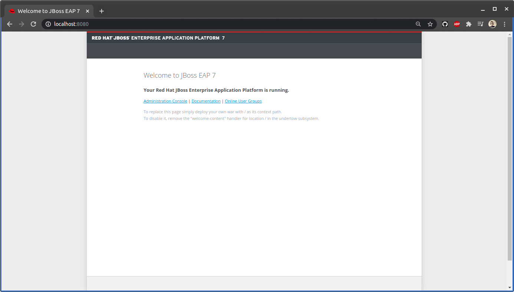

<div class="logo">
    
    
</div>

# app-web				

## Table of Contents

- [About](#about)
- [Prerequisites](#Prerequisites)
- [Usage](#Usage)
- [Questions?](#questions)
- [License](#license)

## About

This web application is designed using **Red Hat JBoss Enterprise Application**
**Platform** on *back end* side, and **Angular** in *front end* side. 

## Prerequisites

### JBoss EAP Installation Prerequisites

- Ensure that a *supported Java Development Kit (JDK)* has been installed. Here
I am using **java-11-openjdk**.
- Download [JBoss EAP 7.3.0](https://developers.redhat.com/content-gateway/file/jboss-eap-7.3.0-installer.jar).
- On **Linux** terminal, run the graphical installer using the following
command and follow the instructions:<br>
```
                $ cd ~/Downloads
                $ java -jar jboss-eap-7.3.0-installer.jar
``` 
- Now, **JBoss EAP 7.3.0** is installed, so let's run our **Red Hat JBoss**
**Enterprise Application Platform** by typing on the terminal:<br>
```
                $ cd ~/EAP7.3.0/bin
                $ ./standalone
```
- Open your browser and do **localhost:8080**, you will get something like this:

<div class="img" align="center">
    
</div>

### Angular Installation Prerequisites

- Firstly, we need to install **Node.js** and **npm** from *NodeSource* by using
the following command:<br>
```
                $ curl -sL https://deb.nodesource.com/setup_12.x | sudo -E bash -
                $ sudo apt install nodejs
```
- Verify that **the Node.js** and **npm** were successfully installed by
printing their versions:<br>
```    
                $ node --version
```
```
                Output
                v12.18.2
```
```
                $ npm --version
```
```
                Output
                6.14.10
```
- Then install **the Angular CLI**, open a terminal window and run the 
following command:<br>
```
                $ npm install -g @angular/cli
```

## Usage

### Back end

- To run our **Red Hat JBoss Enterprise Application Platform** by typing on the
 terminal:<br>
```
                $ cd ~/EAP7.3.0/bin
                $ ./standalone
```

### Front end

- To execute the front end side, type the following commands on **Linux**
terminal:<br>
```
                $ cd front-end
                $ ng serve -o
```

## Questions?

If you have any questions, you can contact me on [Gmail](hz.mouddene@gmail.com).

## License

This project is Open Source Software released under the [License](LICENSE).
